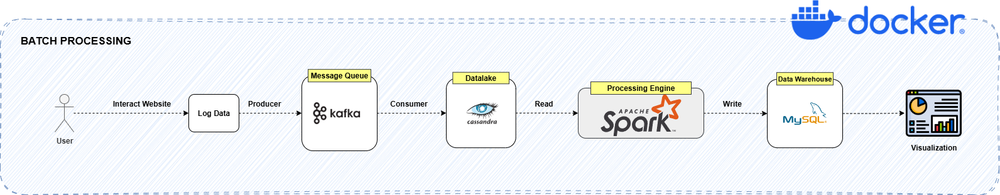
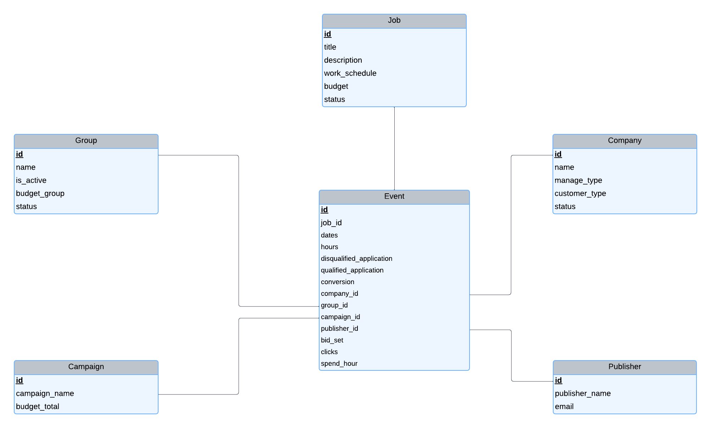

# Data Pipeline for Recruitment Star-Up

# CHAPTER I — Introduction

## 1.1 Problem Statement

- In today's competitive recruitment landscape, companies struggle to track and analyze the performance of their job postings in real-time. Recruitment platforms need to gather, process, and aggregate various metrics such as clicks, applications, and qualification status to evaluate the effectiveness of each job posting. The lack of efficient tracking systems leads to delayed insights, missed opportunities, and poor decision-making.
- Recruiters often rely on disparate systems to collect data, which results in fragmented reporting and an inability to make timely adjustments to their campaigns. Without a unified pipeline that consolidates and processes these metrics, recruitment teams face challenges in understanding how candidates engage with job listings and how effectively they are reaching their target audience.
- To solve these challenges, there is a clear need for a robust data pipeline that can collect, process, and analyze recruitment data in real-time, providing actionable insights to optimize recruitment efforts and drive better business outcomes.

## 1.2 Objective

The **Data Pipeline for Recruitment Start-Up** project aims to aggregate key metrics related to job recruitment events on the website. These metrics include:

- **Total number of clicks** on job listings.
- **Number of applicants** who applied for jobs.
- **Number of qualified applicants** and **unqualified applicants** based on job requirements.

The goal of this project is to build an ETL pipeline that efficiently collects, processes, and aggregates data from various recruitment events, providing valuable insights to recruiters to help refine their recruitment strategies.

## 1.3 Requirements

- **Real-time or near real-time processing**: The data pipeline should run in near real-time or real-time, processing and aggregating the data regularly.
- **Spark Job**: The processing and aggregation tasks will be executed using **Apache Spark**. Spark SQL or PySpark will be used to perform aggregations, filtering, and joining data.
- **Data Storage**: Data will be stored in **Cassandra** (datalake) and **MySQL** (data warehouse). Data will be extracted from Cassandra, processed using Spark, and loaded into MySQL for further analysis.

## 1.4 Input and Output

### Input:

- **Logs from Datalake**: Raw event data (clicks, conversions, qualified, unqualified) from Cassandra.
- **Dimension Tables in Data Warehouse**: Information about jobs, campaigns, publishers, and groups from MySQL to join and calculate the required metrics.

### Output:

- **Events Table in Data Warehouse**: A table containing aggregated metrics (clicks, conversions, qualified, unqualified) for each job, campaign, and publisher by hour and day.

# CHAPTER II — Data Pipeline Overview

## 2. 1 Data Pipeline Architecture



## 2.2 Data Flow

The data flow in the system is divided into three major steps:

1. **Data Ingestion**:
    - Raw event data (logs) is collected from the **datalake** (where logs are stored). This data includes events such as clicks, applications, and the status of applicants (qualified or unqualified).
2. Change Data Capture (CDC) Mechanism:
    - Before processing, the pipeline compares the latest timestamps of data in Cassandra and MySQL:
        - Retrieve the latest `create_time` from Cassandra.
        - Retrieve the latest `updated_at` from MySQL Events Table.
    - **Only new data** in Cassandra that has a timestamp later than the MySQL latest timestamp will be processed. If no new data exists, the ETL job will skip processing, reducing unnecessary computation.
3. **Data Processing and Aggregation**:
    - **Apache Spark** is used to process the data and compute necessary aggregations like total clicks, total applicants, and the number of qualified and unqualified applicants by job, campaign, and publisher.
4. **Data Storage and Querying**:
    - The aggregated results are stored in a **data warehouse** (where the summarized events are stored) in the **Events Table**. From here, users can query the data, such as viewing aggregated metrics for specific jobs, campaigns, and publishers over time.

## 2.3 Data Structure

### Data in Datalake (Logs Data)

In the **datalake**, the data is in raw event form (logs) that tracks user actions on the website. This data includes the following fields:

- **`create_time`**: Timestamp of when the event occurred.
- **`job_id`**: The job ID that the applicant clicked or applied to.
- **`campaign_id`**: The campaign ID for the job.
- **`group_id`**: The ID of the group associated with the campaign.
- **`publisher_id`**: The ID of the publisher or the job provider.
- **`custom_track`**: The type of event (e.g., `click`, `conversion`, `qualified`, `unqualified`).
- **`bid`**: The bid amount for the job (if applicable).
- …

### Data in Data Warehouse (Aggregated Events)

In the **data warehouse**, the data is stored in an aggregated form in the **Events Table**. This table contains the following fields:

- **`job_id`**: Job ID.
- **`date`**: Date of the event.
- **`hour`**: Hour of the event.
- **`publisher_id`**: Publisher ID.
- **`campaign_id`**: Campaign ID.
- **`group_id`**: Group ID of the campaign.
- **`clicks`**: Total number of clicks for the job.
- **`conversions`**: Total number of applicants for the job.
- **`qualified`**: Number of applicants who met the job requirements.
- **`unqualified`**: Number of applicants who did not meet the job requirements.
- **`bid_set`**: The bid value (if applicable).
- **`spend_hour`**: The amount spent on the campaign during the hour.

Additionally, there are some dimension tables in Data Warehouse:



## 2.4 Data Processing Pipeline

1. **Extract Data from Datalake (Cassandra)**:
    - Raw event data is read from Cassandra, and the events are filtered by types (click, conversion, qualified, unqualified). This data is processed in Spark.
2. **Process Data Using Spark**:
    - Spark is used to calculate the following aggregates:
        - Total number of clicks (count of `click` events).
        - Total number of applicants (count of `conversion` events).
        - Number of qualified applicants (count of `qualified` events).
        - Number of unqualified applicants (count of `unqualified` events).
3. **Aggregate and Load Data into Data Warehouse (MySQL)**:
    - After aggregating the data, the results are loaded into MySQL, where they are stored in the **Events Table** with the aggregated metrics (clicks, conversions, qualified, unqualified, etc.) by hour and day.

# CHAPTER III — Getting Started

## 3. 1 Prerequisites

- Docker & Docker Compose plugin (`docker compose` command available)
- Free ports on `docker-compose.yml` (commonly: `9042` for Cassandra, `3306` for MySQL)

## 3.2 Quick Start

Clone the repository:

```python
https://github.com/huytoan210/Data-Pipeline-For-Recruiment-Start-Up
```

Download jars file for Spark:

```python
cd spark
mkdir jars
cd jars
curl -O https://repo1.maven.org/maven2/com/mysql/mysql-connector-j/8.0.33/mysql-connector-j-8.0.33.jar
curl -O https://repo1.maven.org/maven2/com/datastax/spark/spark-cassandra-connector-assembly_2.12/3.3.0/spark-cassandra-connector-assembly_2.12-3.3.0.jar
```

From the project root:

```bash
docker-compose up -d --build
```

This builds the Spark image and starts **Cassandra**, **MySQL**, and the **Spark** container.

Check status:

```bash
docker-compose ps
docker logs cassandra -f
docker logs mysql -f
```

### Initialize Datastores

**Cassandra Schema**

Open Cassandra shell to create keyspace/tables:

```python
docker compose exec cassandra cqlsh -f /cassandra-init/init.cql
```

Load sample CSV

```bash
docker cp ./data/tracking.csv cassandra:/tracking.csv
docker compose exec cassandra cqlsh -e \
"COPY logs.tracking (create_time,bid,campaign_id,custom_track,group_id,job_id,publisher_id,ts)
 FROM '/tracking.csv' WITH HEADER=TRUE;"
```

**MySQL Schema**

Create fact and dimension tables in data warehouse:

```python
docker exec -it mysql mysql -u user -p
# password: userpass
CREATE DATABASE outputdb;
USE outputdb;
# Then copy the DDL script in mysql-init/init.sql to create table
```

> Default creds are defined in `docker-compose.yml` (commonly: `MYSQL_DATABASE=outputdb`, `MYSQL_USER=user`, `MYSQL_PASSWORD=userpass`).
> 

After that, import data of dimension tables into MySQL.

### Run the Spark ETL

### Option A — Auto via Compose

If your `spark` service runs `spark-submit /app/main.py` as its command, the job executes after services are healthy.

### Option B — Manual trigger (re-runs on demand)

```bash
docker-compose up spark
```

**What the job does**

1. Reads `logs.tracking` from **Cassandra**.
2. Aggregates by `job_id, date(ts), hour(ts), publisher_id, campaign_id, group_id`:
    - `clicks`, `conversion`, `qualified_application`, `disqualified_application`
    - `avg(bid)` and hourly spend
3. Joins with **MySQL** dimension tables (e.g., `job`) for company/group/campaign metadata.
4. Writes the aggregated rows to **MySQL** table (e.g., `outputdb.events`).


### (Optional) Stream Fake Data

Keep fresh events flowing from Kafka to Cassandra by a consumer for continuous ETL tests.
- The `kafka-producer` will continuously publish fake data into kafka topic and then be consumed by `kafka-consumer` and upserts to Cassandra table

**From the terminal:**

```bash
docker-compose up kafka-producer
docker-compose up kafka-consumer
```

---

### Inspect Results

**MySQL (events):**

```bash
docker compose exec mysql mysql -uuser -puserpass -e \
"USE outputdb;
 SELECT dates,hours,job_id,publisher_id,company_id,campaign_id,group_id,
        clicks,conversion,qualified_application,disqualified_application,
        bid_set,spend_hour
 FROM events
 ORDER BY dates DESC, hours DESC
 LIMIT 20;"

```

**Cassandra (quick checks):**

```bash
docker compose exec cassandra cqlsh -e "DESCRIBE KEYSPACES;"
docker compose exec cassandra cqlsh -e "DESCRIBE TABLE logs.tracking;"
```

---


### Cleanup

```bash
# Stop containers (keep data)
docker compose down

# Remove containers + named volumes (DANGEROUS: wipes data)
docker compose down -v
```